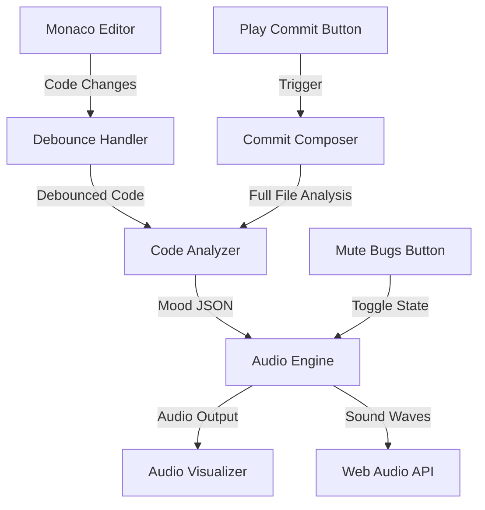

# Symphony.js Design Document

## Overview

Symphony.js is a web-based application that combines a Monaco Editor instance with a Tone.js audio engine to provide real-time auditory feedback about code quality and structure. The system uses a React-based architecture with three main subsystems: the code editor, the audio engine, and the analysis bridge that connects them.

## Architecture

### High-Level Architecture



### Technology Stack

- **Frontend Framework**: React 18+ with TypeScript
- **Code Editor**: Monaco Editor (@monaco-editor/react)
- **Audio Engine**: Tone.js 14+
- **Build Tool**: Vite
- **Styling**: CSS Modules or Tailwind CSS

### Component Hierarchy

```
App
├── EditorPanel
│   ├── MonacoEditor
│   └── ControlBar
│       ├── PlayCommitButton
│       └── MuteBugsButton
├── VisualizerPanel
│   └── WaveformVisualizer
└── AudioEngine (Context Provider)
    ├── InstrumentManager
    │   ├── RhythmInstrument
    │   ├── HarmonyInstrument
    │   └── MelodyInstrument
    └── AudioController
```

## Components and Interfaces

### 1. EditorPanel Component

**Responsibilities:**
- Render Monaco Editor with syntax highlighting
- Handle user input and code changes
- Manage editor configuration (theme, language)

**Props:**
```typescript
interface EditorPanelProps {
  onCodeChange: (code: string) => void;
  language: 'javascript' | 'python';
  initialCode?: string;
}
```

**Key Methods:**
- `handleEditorChange(value: string)`: Captures code changes and triggers debounced analysis
- `setLanguage(lang: string)`: Switches syntax highlighting mode

### 2. AudioEngine Context

**Responsibilities:**
- Initialize and manage Tone.js instruments
- Process mood JSON and trigger appropriate sounds
- Handle mute state for error sounds

**Interface:**
```typescript
interface MoodData {
  tempo: number;        // 60-180 BPM
  rootKey: string;      // e.g., "C", "Dm", "F#"
  intensity: number;    // 0.0-1.0
  mood: 'DISCORDANT' | 'HARMONIOUS' | 'INTENSE';
}

interface AudioEngineContext {
  playMood(data: MoodData): void;
  playCommitComposition(sections: CompositionSection[]): void;
  toggleMuteBugs(): void;
  isBugsMuted: boolean;
}
```

### 3. InstrumentManager

**Responsibilities:**
- Create and configure three Tone.js instruments
- Map mood data to instrument parameters

**Instruments Configuration:**

```typescript
// Rhythm Instrument (Drums)
const rhythmSynth = new Tone.MembraneSynth({
  pitchDecay: 0.05,
  octaves: 4,
  oscillator: { type: 'sine' },
  envelope: { attack: 0.001, decay: 0.4, sustain: 0.01, release: 1.4 }
});

// Harmony Instrument (Synth Pads)
const harmonySynth = new Tone.PolySynth(Tone.Synth, {
  oscillator: { type: 'sine' },
  envelope: { attack: 0.5, decay: 0.2, sustain: 0.5, release: 2 }
});

// Melody Instrument (Piano/Lead)
const melodySynth = new Tone.Synth({
  oscillator: { type: 'triangle' },
  envelope: { attack: 0.005, decay: 0.1, sustain: 0.3, release: 1 }
});
```

### 4. CodeAnalyzer Service

**Responsibilities:**
- Analyze code structure and quality
- Detect syntax errors, nesting depth, complexity
- Generate mood JSON output

**Interface:**
```typescript
interface CodeAnalyzer {
  analyze(code: string, language: string): MoodData;
  analyzeForComposition(code: string, language: string): CompositionSection[];
}

interface CompositionSection {
  type: 'import' | 'function' | 'return' | 'other';
  duration: number;  // in seconds
  notes: string[];   // e.g., ['C4', 'E4', 'G4']
  tempo: number;
}
```

**Analysis Logic:**

```typescript
function analyze(code: string, language: string): MoodData {
  const errors = detectSyntaxErrors(code, language);
  const nestingDepth = calculateNestingDepth(code);
  const hasRecursion = detectRecursion(code);
  const hasComments = detectComments(code);
  
  let mood: MoodData['mood'];
  let rootKey: string;
  let intensity: number;
  
  if (errors.length > 0) {
    mood = 'DISCORDANT';
    rootKey = 'Dm'; // Minor key
    intensity = 0.8;
  } else if (hasComments && nestingDepth <= 2) {
    mood = 'HARMONIOUS';
    rootKey = 'C'; // Major key
    intensity = 0.3;
  } else if (hasRecursion || nestingDepth > 4) {
    mood = 'INTENSE';
    rootKey = 'Am';
    intensity = 0.9;
  } else {
    mood = 'HARMONIOUS';
    rootKey = 'G';
    intensity = 0.5;
  }
  
  const tempo = 60 + (intensity * 120); // 60-180 BPM
  
  return { tempo, rootKey, intensity, mood };
}
```

### 5. WaveformVisualizer Component

**Responsibilities:**
- Display real-time audio waveforms
- Connect to Tone.js analyzer node

**Implementation:**
```typescript
interface VisualizerProps {
  audioContext: Tone.Context;
}

// Uses Tone.Waveform for real-time visualization
const waveform = new Tone.Waveform(1024);
Tone.Master.connect(waveform);
```

### 6. DebounceHandler

**Responsibilities:**
- Debounce code changes to avoid excessive analysis
- Trigger analysis after 500ms of inactivity

**Implementation:**
```typescript
const debouncedAnalyze = useMemo(
  () => debounce((code: string) => {
    const moodData = codeAnalyzer.analyze(code, language);
    audioEngine.playMood(moodData);
  }, 500),
  [language]
);
```

## Data Models

### MoodData Model

```typescript
type MoodState = 'DISCORDANT' | 'HARMONIOUS' | 'INTENSE';

interface MoodData {
  tempo: number;        // Range: 60-180
  rootKey: string;      // Musical key (e.g., 'C', 'Dm', 'F#')
  intensity: number;    // Range: 0.0-1.0
  mood: MoodState;
}
```

### CompositionSection Model

```typescript
interface CompositionSection {
  type: 'import' | 'function' | 'return' | 'loop' | 'conditional' | 'other';
  startLine: number;
  endLine: number;
  duration: number;     // Seconds allocated in 15s composition
  notes: string[];      // Array of note names
  tempo: number;
  instrument: 'rhythm' | 'harmony' | 'melody';
}
```

### AudioState Model

```typescript
interface AudioState {
  isPlaying: boolean;
  isBugsMuted: boolean;
  currentMood: MoodState;
  volume: number;       // 0.0-1.0
}
```

## Error Handling

### Syntax Error Detection

- Use Monaco Editor's built-in language services to detect errors
- Access `monaco.editor.getModelMarkers()` for error information
- Map error severity to audio intensity

### Audio Engine Errors

```typescript
try {
  await Tone.start(); // Required for browser audio context
  audioEngine.playMood(moodData);
} catch (error) {
  console.error('Audio engine error:', error);
  // Fallback: Display visual-only feedback
  showVisualFeedback(moodData);
}
```

### Browser Compatibility

- Check for Web Audio API support on mount
- Provide graceful degradation if audio is unavailable
- Display warning message to user

```typescript
const isAudioSupported = () => {
  return !!(window.AudioContext || (window as any).webkitAudioContext);
};
```

## Testing Strategy

### Unit Tests

**CodeAnalyzer Tests:**
- Test mood detection for various code samples
- Verify correct JSON output format
- Test edge cases (empty code, very long files)

**InstrumentManager Tests:**
- Verify instrument initialization
- Test mood-to-sound mapping
- Verify mute functionality

### Integration Tests

**Editor-to-Audio Flow:**
- Type code and verify audio triggers after 500ms
- Test "Play Commit" button generates 15s composition
- Verify "Mute Bugs" button silences error sounds only

### End-to-End Tests

**Success Metrics (from requirements):**
- Typing `function hello() { return true; }` produces pleasant "ding"
- Typing `fucntion helo( { retunr false }` produces jagged buzzing
- Verify split-screen layout renders correctly
- Test language switching (JavaScript ↔ Python)

### Manual Testing Checklist

- [ ] Audio plays on first keystroke after user interaction
- [ ] Visualizer updates in real-time
- [ ] No audio glitches or crackling
- [ ] Performance remains smooth with large files (>1000 lines)
- [ ] Dark mode styling is consistent

## Performance Considerations

### Debouncing Strategy

- 500ms debounce prevents excessive analysis
- Cancel pending analysis on rapid typing
- Use `requestIdleCallback` for non-critical analysis

### Audio Buffer Management

- Pre-load common sound patterns
- Limit simultaneous voices to prevent distortion
- Use Tone.js built-in voice limiting

### Code Analysis Optimization

- Limit analysis to visible code range for large files
- Cache analysis results for unchanged code sections
- Use Web Workers for heavy parsing (future enhancement)

## Future Enhancements

1. **Custom Instrument Selection**: Allow users to choose different synth types
2. **Export Compositions**: Save commit compositions as MIDI or audio files
3. **Collaborative Mode**: Hear other developers' code in real-time
4. **AI-Enhanced Analysis**: Use LLM for deeper code quality assessment
5. **Visual Themes**: Match visualizer colors to mood states
